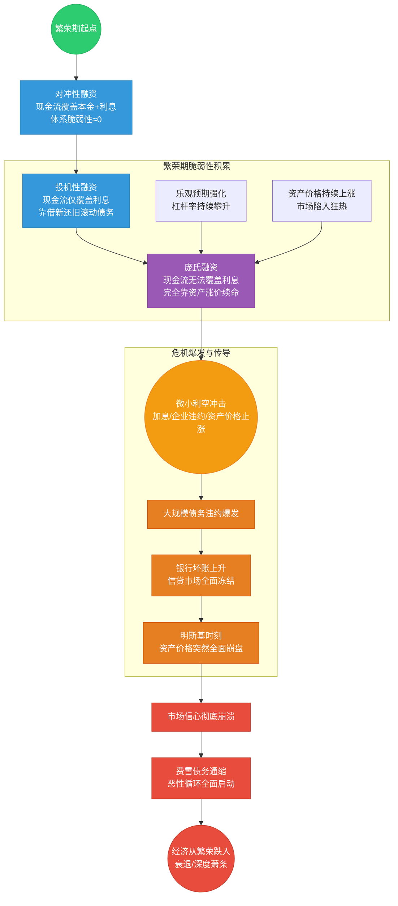

|融资阶段|核心定义|所处周期|经济特征|体系脆弱性|
|:--|:--|:--|:--|:--|
|对冲性融资|企业/主体的现金流，完全可以覆盖债务的本金+利息|萧条后的复苏期|刚经历危机，市场主体极度谨慎，只有现金流稳定、前景确定的项目能拿到融资，杠杆率极低，金融体系健康|几乎为零，经济最稳定的阶段，但也是不稳定的起点|
|投机性融资|企业/主体的现金流，只能覆盖债务的利息，无法偿还本金，只能靠借新还旧滚动债务，赌资产价格持续上涨|繁荣期|经济持续增长，资产价格稳步上涨，市场预期越来越乐观，企业和家庭开始加杠杆，信贷持续扩张，股市、房市繁荣|快速积累，表面繁荣，实则已经进入脆弱性上升通道|
|庞氏融资|企业/主体的现金流，连利息都覆盖不了，完全靠借新债还旧债的利息和本金，只能靠资产价格的持续暴涨续命|泡沫期|经济虚假繁荣，资产价格完全脱离基本面，全民加杠杆投机，信贷疯狂扩张，市场陷入“永远涨”的狂热|濒临极限，明斯基时刻已进入倒计时，只要资产价格停止上涨，债务链条就会瞬间断裂|
## 费雪债务通缩
![[Pasted image 20260506165047.png]]

明斯基时刻
![[4.png]]

大萧条完整传导
![[6.png]]

## 相关
[[向心坍缩]]
[[费雪债务通缩]]